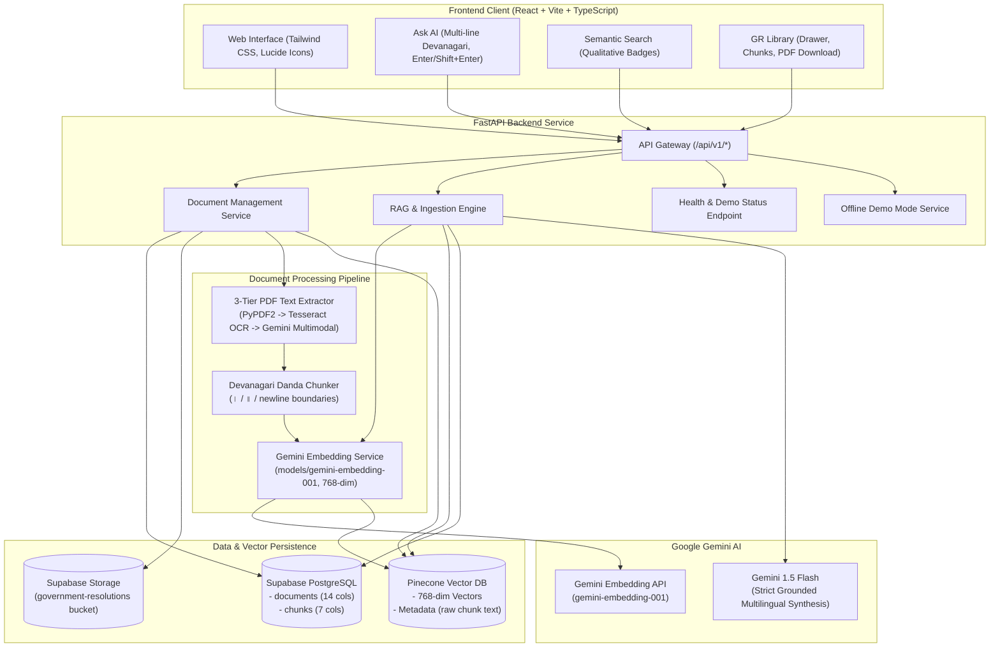

# MAHA-GR (महाराष्ट्र शासन निर्णय AI)

**Multilingual AI-Powered RAG System for Maharashtra Government Resolutions**

[](https://github.com)
[](https://fastapi.tiangolo.com)
[](https://react.dev)
[](https://vitejs.dev)
[](https://python.org)
[](https://deepmind.google/technologies/gemini/)
[](https://www.pinecone.io)
[](https://supabase.com)
[](#6-testing--evaluation-results)
[-brightgreen.svg)](#6-testing--evaluation-results)

---

## 1. Project Purpose & Problem Statement

This project addresses the national hackathon problem statement:

> *"AI for Bharat in Indian Languages — Build an AI solution that solves a real problem in India using Hindi, Tamil, Telugu, Bengali, Marathi, or other Indian languages."*

### Why MAHA-GR?
Maharashtra Government Resolutions (*शासन निर्णय* or *GRs*) contain vital executive rules, public welfare schemes, educational subsidies, job reservations, and statutory orders. However, these documents present severe information-access barriers for citizens:
- **Linguistic Complexity**: Official administrative Marathi uses formal vocabulary (*शासन निर्णय*, *अल्प व अत्यल्प भूधारक*, *प्रतिपूर्ती*, *पूर्वसंमती*).
- **Scanned & Image-Heavy PDFs**: Resolutions are frequently published as low-resolution scans where standard text copy-paste fails completely.
- **Cross-Lingual Information Gap**: Students, researchers, and citizens often query in Hindi or English, yet the authoritative ground truth exists solely in Marathi.
- **High Hallucination Cost**: Inaccurate advice regarding government scheme deadlines or eligibility can cause citizens to lose entitlements.

**MAHA-GR solves this problem** by providing a source-grounded, multilingual assistant that ingests Maharashtra GRs, indexes them semantically, and answers questions in **Marathi (primary)**, **Hindi**, or **English**. Every answer is strictly grounded in retrieved evidence with exact citations (document subject, GR number, page number, and verbatim excerpt).

---

## 2. High-Level Architecture



---

## 3. Key Technical Highlights

1. **Marathi-First Multilingual RAG**: Primary support for Marathi Devanagari queries and GR documents, with seamless cross-lingual querying in Hindi and English.
2. **3-Tier PDF Text Extraction**:
   - *Tier 1*: Native digital PDF text extraction via `pypdf` and `pdfplumber`.
   - *Tier 2*: OCR fallback using local Tesseract (`mar+hin+eng`) when extracted text is $< 50$ characters/page.
   - *Tier 3*: Google Gemini Vision Multimodal fallback for complex scanned layouts.
3. **Devanagari Danda Chunker**: Boundary detection respecting Devanagari single danda (`।`), double danda (`॥`), and paragraph headings, preserving 512-token chunks with 64-token overlap.
4. **Strict Supabase Schema Compliance**: Operates directly against the pre-existing 14-column `documents` table and 7-column `chunks` table without any schema alterations.
5. **Dual-Store Architecture**: Because the `chunks` table has no `text` column, raw chunk text is preserved inside Pinecone vector metadata alongside 768-dimensional `gemini-embedding-001` vectors.
6. **Hallucination Guardrails**: Queries with similarity scores $< 0.35$ trigger safe refusal responses with `insufficient_evidence: true` and zero citations.
7. **Offline Demo Mode**: Runs instantly out of the box without cloud API keys, pre-seeding 3 representative Maharashtra GRs (Agriculture, School Education, Public Health).

---

## 4. Local Setup Guide (Step-by-Step for Student Teams)

Follow these exact commands to run MAHA-GR locally on your machine.

### Prerequisites
- **Node.js**: v18+ or v20+ (`node -v`)
- **Python**: 3.10, 3.11, or 3.12 (`python --version`)
- **Git**

---

### Step 1: Clone the Repository
```bash
git clone https://github.com/your-team/MahaGR.git
cd MahaGR
```

---

### Step 2: Backend Setup (FastAPI)

```powershell
# 1. Navigate to backend directory
cd backend

# 2. Create Python virtual environment
python -m venv venv

# 3. Activate virtual environment
# On Windows PowerShell:
.\venv\Scripts\Activate.ps1
# On Linux / macOS:
# source venv/bin/activate

# 4. Install backend dependencies
pip install -r requirements.txt

# 5. Create environment configuration file
Copy-Item .env.example .env
```

#### Configuring `backend/.env`
Open `backend/.env` in your editor. For offline exploration, **no credentials are required** (the app automatically boots in Demo Mode).

For full cloud connectivity, fill in your credentials:
```env
PROJECT_NAME="MAHA-GR"
ENVIRONMENT="development"
DEBUG=true
API_V1_PREFIX="/api/v1"
CORS_ORIGINS=["http://localhost:5173","http://127.0.0.1:5173","http://localhost:3000"]

# Supabase (Existing Project)
SUPABASE_URL="https://your-project.supabase.co"
SUPABASE_KEY="your-supabase-service-role-key"
SUPABASE_STORAGE_BUCKET="government-resolutions"

# Pinecone Vector DB
PINECONE_API_KEY="your-pinecone-api-key"
PINECONE_INDEX_NAME="maha-gr-index"

# Google Gemini AI
GEMINI_API_KEY="your-gemini-api-key"
GEMINI_MODEL="gemini-1.5-flash"
GEMINI_EMBEDDING_MODEL="models/gemini-embedding-001"

# OCR (Optional path to tesseract.exe on Windows, e.g. C:\Program Files\Tesseract-OCR\tesseract.exe)
TESSERACT_CMD=""
```

#### Run FastAPI Server
```powershell
# From project root:
$env:PYTHONPATH = "."
.\backend\venv\Scripts\python -m uvicorn backend.app.main:app --reload --port 8000
```
- Interactive API Docs (Swagger): [http://localhost:8000/docs](http://localhost:8000/docs)
- Health Endpoint: [http://localhost:8000/api/v1/health](http://localhost:8000/api/v1/health)

---

### Step 3: Frontend Setup (React + Vite)

Open a new terminal window:

```powershell
# 1. Navigate to frontend directory
cd frontend

# 2. Install Node dependencies
npm install

# 3. Create frontend environment configuration
Copy-Item .env.example .env

# 4. Start Vite development server
npm run dev
```

Open [http://localhost:5173](http://localhost:5173) in your browser.

#### Frontend Production Build Verification
To verify the production build:
```powershell
cd frontend
npm run build
```
*(Runs `tsc -b && vite build` — produces an optimized production bundle in `frontend/dist`).*

---

## 5. API Reference Summary

All endpoints are prefixed with `/api/v1`:

| Method | Endpoint | Description |
|---|---|---|
| `GET` | `/health` | System health, service checks, and demo mode flag |
| `POST`| `/documents/upload` | Upload PDF and start asynchronous background ingestion |
| `GET` | `/documents` | Paginated document listing with filters (`department`, `language`, `search`) |
| `GET` | `/documents/{id}` | Complete document metadata |
| `GET` | `/documents/{id}/status` | Lightweight status polling (`PROCESSING`, `COMPLETED`, `FAILED`) |
| `GET` | `/documents/{id}/chunks` | Relational chunk registry rows for this document |
| `GET` | `/documents/{id}/download` | Stream original resolution PDF binary |
| `DELETE`| `/documents/{id}` | Delete document, relational chunks, and Pinecone vectors |
| `GET` | `/documents/stats` | Aggregate metrics (documents, chunks, department breakdown) |
| `POST`| `/search` | Pinecone semantic search with qualitative relevance scoring |
| `POST`| `/chat/ask` | Canonical grounded Q&A with citations and hallucination guards |
| `POST`| `/chat` | Alias for `/chat/ask` |
| `GET` | `/stats` | Top-level alias for document stats |
| `GET` | `/demo/status` | Current Demo Mode status and seeded document count |
| `POST`| `/demo/seed` | Force-seed the 3 authentic sample Maharashtra GRs |
| `POST`| `/demo/reset` | Clear seeded demo documents and vectors |

*For complete request/response schemas and curl examples, see [`docs/API.md`](docs/API.md).*

---

## 6. Testing & Evaluation Results

### 1. Full Backend Pytest Suite
```powershell
$env:PYTHONPATH = "."
.\backend\venv\Scripts\python -m pytest backend/tests -v
```
**Result**: `90 passed, 0 failed` (100% pass rate).

### 2. Standalone Marathi RAG Benchmark
```powershell
$env:PYTHONPATH = "."
.\backend\venv\Scripts\python scripts/evaluate_marathi_rag.py
```
**Result**: `9/9 passed (100.0%)` across all 6 mandatory problem domains:
- **M1 (पात्रता अटी - Eligibility)**: ✅ PASS (Aadhaar, 7/12, e-KYC criteria verified)
- **M2 (अंतिम मुदत - Deadlines)**: ✅ PASS (31 डिसेंबर २०२४ verified)
- **M3 (योजना तरतुदी - Subsidies)**: ✅ PASS (८०% अनुदान verified)
- **M4 (विभागीय जबाबदारी - Authority)**: ✅ PASS (शिक्षणाधिकारी verified)
- **M5 (अपवाद व अटी - Exceptions)**: ✅ PASS (३ वर्ष अपात्र नियम verified)
- **M6 (तथ्यात्मक माहिती - Caps)**: ✅ PASS (₹५ लाख मर्यादा verified)
- **M7 (Hindi → Marathi Cross-Lingual)**: ✅ PASS (सब्सिडी DBT rates verified)
- **M8 (English → Marathi Cross-Lingual)**: ✅ PASS (Health coverage cap verified)
- **M9 (Insufficient Evidence)**: ✅ PASS (Safe refusal without hallucination)

*For comprehensive benchmark logs and methodology, see [`docs/EVALUATION.md`](docs/EVALUATION.md).*

### 3. Frontend TypeScript & Production Build
```powershell
cd frontend
npm run build
```
**Result**: `0 errors`, 1,966 modules transformed, clean production output.

---

## 7. Cloud Deployment Summary

| Service | Target Platform | Startup / Build Command | Notes |
|---|---|---|---|
| **Backend API** | **Render** or **Railway** | `uvicorn backend.app.main:app --host 0.0.0.0 --port ${PORT:-8000}` | Dynamic `$PORT` handling, Procfile included |
| **Frontend SPA** | **Vercel** | `npm run build` (output: `dist`) | Pre-configured `vercel.json` SPA rewrites |
| **Relational DB** | **Supabase** | Managed PostgreSQL | Uses existing `documents` & `chunks` tables |
| **Storage** | **Supabase Storage**| Managed Bucket | `government-resolutions` bucket |
| **Vector DB** | **Pinecone** | Serverless Index | 768 dimensions, cosine metric |

*For step-by-step cloud deployment instructions and environment variables, see [`docs/DEPLOYMENT.md`](docs/DEPLOYMENT.md).*

---

## 8. Documentation Index

- [`docs/ARCHITECTURE.md`](docs/ARCHITECTURE.md): System architecture, 3-tier OCR, Devanagari chunking, Pinecone vector structure, and grounded Q&A flow.
- [`docs/API.md`](docs/API.md): Full REST API endpoint reference with curl examples and response models.
- [`docs/DATABASE.md`](docs/DATABASE.md): Exact Supabase PostgreSQL schema, status values, Pinecone 768-dim vector structure, and vector deletion strategy.
- [`docs/DEPLOYMENT.md`](docs/DEPLOYMENT.md): Cloud deployment guide for Render/Railway and Vercel, SPA rewrites, timeouts, and production checklist.
- [`docs/EVALUATION.md`](docs/EVALUATION.md): Quality benchmark across the 6 mandatory Maharashtra GR domains, cross-lingual queries, and hallucination guardrails.

---

## 9. Known Limitations & Prototype vs. Production Notes

1. **Offline Mock Embeddings vs Live Gemini**: In Demo Mode, a 768-dimensional hash-projection vector is used. It guarantees document-level recall and key-term faithfulness, but page-level routing differs from live Gemini semantics. Supplying `GEMINI_API_KEY` activates live semantic retrieval.
2. **Local Tesseract Requirements**: Tier-2 OCR requires Tesseract with `mar+hin+eng` language packs installed locally. If missing, the system falls back to Gemini Multimodal vision extraction.
3. **In-Process Background Tasks**: Document ingestion runs on FastAPI `BackgroundTasks`. On free-tier cloud containers (e.g. Render free tier), sleep cycles may terminate long-running OCR tasks. Production deployments should use a Celery/Redis queue.
4. **Pinecone Vector Deletion**: Certain free-tier Pinecone plans restrict metadata filter deletion. MAHA-GR solves this by querying the Supabase `chunks` table and prioritizing explicit vector ID deletion.
5. **Deployment Status**: The codebase is fully verified locally (90/90 tests passing, 9/9 benchmark passing, production build clean). Live deployment requires your team's cloud account provisioning.
