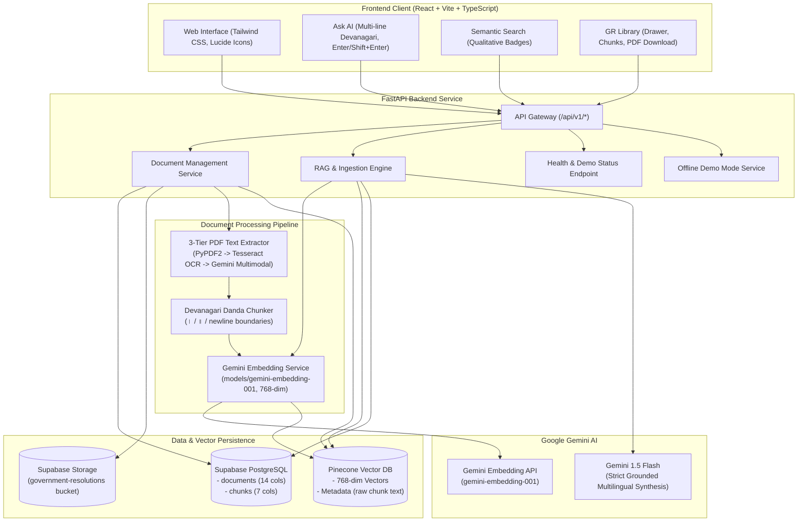
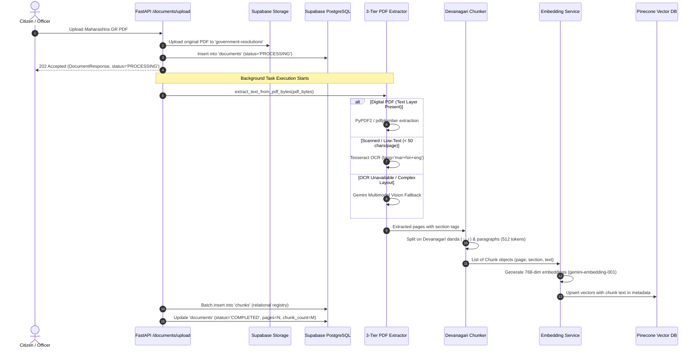
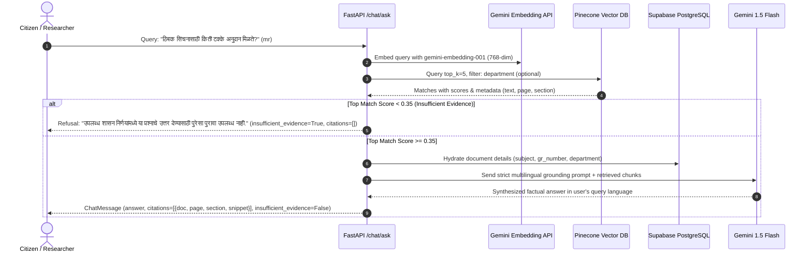

# MAHA-GR System Architecture

**Multilingual AI-Powered RAG System for Maharashtra Government Resolutions**  
*Hackathon Track: AI for Bharat in Indian Languages (Marathi-First, Hindi, English)*

---

## 1. Problem Statement & Objective

Maharashtra Government Resolutions (*शासन निर्णय* or *GRs*) govern executive actions across the state: welfare scheme eligibility, educational admissions, financial subsidies, administrative appointments, and statutory exceptions. 

However, these official documents present significant barriers for everyday citizens, researchers, and local administrative officers:
1. **Linguistic Complexity**: Official administrative Marathi contains specialized vocabulary (*शासन निर्णय*, *अल्प व अत्यल्प भूधारक*, *प्रतिपूर्ती*, *पूर्वसंमती*).
2. **Format Discrepancies**: Many historic and recent GRs are published as scanned, low-contrast, or image-heavy PDFs where plain text extraction fails.
3. **Cross-Lingual Demand**: Citizens and national researchers frequently ask questions in Hindi or English, yet the authoritative ground-truth documents are written solely in Marathi.
4. **Hallucination Risk**: Misinterpreting subsidy percentages, deadlines, or eligibility criteria can have immediate negative consequences for citizens.

**MAHA-GR** provides an end-to-end, source-grounded Retrieval-Augmented Generation (RAG) system that processes Maharashtra GRs, indexes them semantically, and enables citizens to ask questions in Marathi, Hindi, or English. Every answer is strictly grounded in retrieved evidence with exact page, section, and GR number citations.

---

## 2. High-Level Architecture



---

## 3. Frontend & Backend Responsibilities

### Frontend Responsibilities (`frontend/`)
- **Technology Stack**: React 19, TypeScript, Vite, Tailwind CSS, React Router v7, Axios, Lucide React.
- **Design Philosophy**: Professional, minimalist public-service aesthetic using Deep Navy (`#0B192C`) as primary, subtle Saffron (`#F97316`) and Green accents, avoiding generic chatbot styling.
- **Devanagari Optimization**: Proper font-stack rendering (`Noto Sans Devanagari`, system Marathi fonts), correct line wrapping, and zero overflow on Devanagari conjuncts (*जोडाक्षरे*).
- **Core Views**:
  - **Dashboard**: Aggregate KPIs (Total, Completed, Processing, Failed, Indexed Chunks), system health, recent GR table.
  - **Ask AI**: Chat interface supporting Marathi, Hindi, and English. Features multi-line `<textarea>`, `Enter` to submit, `Shift+Enter` for newlines, source citation cards (document, page, section, snippet), and an amber warning banner on `insufficient_evidence`.
  - **Search**: Semantic exploration displaying qualitative relevance badges (*High Relevance*, *Direct Match*, *Related Passage*) rather than raw cosine percentages.
  - **GR Library**: Document table with filtering by department, language, and status; right-hand slide-out drawer showing complete metadata, chunk registry, PDF download link, and deep-links to Ask AI and Search.
  - **Upload**: Drag-and-drop PDF uploader with progress tracking, immediate background task trigger, and automatic status polling.
  - **Settings**: Live connectivity checks for Supabase, Pinecone, and Gemini; offline demo mode controls (Seed/Reset sample GRs); schema compliance reference.

### Backend Responsibilities (`backend/`)
- **Technology Stack**: Python 3.12, FastAPI, Pydantic v2, Uvicorn, Pytest.
- **API Routing**: RESTful endpoints organized under `/api/v1/` with Swagger UI documentation (`/docs`).
- **Asynchronous Ingestion**: PDF uploads return immediately with `status="PROCESSING"`. Heavy text extraction, OCR, embedding, and vector upsert execute via FastAPI `BackgroundTasks`.
- **Database Abstraction**: Pure repository pattern (`DocumentRepository`, `ChunkRepository`, `StorageService`, `VectorStoreService`).
- **Strict Schema Enforcement**: Operates strictly against the pre-existing Supabase schema without adding or altering any database columns.
- **Demo Mode Fallback**: Automatically activates when Supabase or Pinecone credentials are not configured, providing in-memory mock stores and 3 authentic Maharashtra GRs for instant evaluation.

---

## 4. Marathi OCR & Ingestion Pipeline

Maharashtra Government Resolutions present unique extraction challenges: mixed bilingual headers, government emblems, stamp seals, tabular budget allocations, and Devanagari ligatures.



### 3-Tier PDF Extraction Engine
1. **Tier 1 (Digital PDFs)**: Extracts text page-by-page using `pypdf` and `pdfplumber`. If a page yields $\ge 50$ characters of text, it is accepted immediately.
2. **Tier 2 (Scanned PDFs)**: If page text is under 50 characters, the page is rendered to an image (`Pillow`) and processed via local Tesseract OCR with `mar+hin+eng` language packs.
3. **Tier 3 (Gemini Multimodal Vision)**: If local Tesseract is not installed or yields low confidence, the raw page bytes are sent to Google Gemini Flash with the instruction: *"Transcribe all Devanagari (Marathi) and English text accurately, preserving section headers, numbers, and dates."*

### Devanagari Danda-Aware Chunking
Standard English chunkers split on periods (`.`), which breaks Devanagari text prematurely. MAHA-GR implements a custom chunker:
- **Boundary Delimiters**: Devanagari single danda (`।`), double danda (`॥`), double newlines (`\n\n`), and periods.
- **Section Preservation**: Tracks official Maharashtra GR section headers (*शासन निर्णय*, *प्रस्तावना*, *पात्रता*, *अटी व शर्ती*, *परिशिष्ट*) and attaches the section title to every sub-chunk.
- **Chunk Parameters**: 512 target token window with a 64-token sliding overlap to avoid semantic fragmentation across boundaries.

---

## 5. Pinecone Vector Structure & Metadata Schema

Because the pre-existing Supabase `chunks` table **does not have a `text` column** and schema alteration is strictly forbidden, MAHA-GR stores the raw text of each passage directly inside Pinecone metadata.

### Vector Specifications
- **Model**: `models/gemini-embedding-001`
- **Dimensions**: 768 float32 values
- **Metric**: Cosine Similarity (`cosine`)
- **Vector ID Format**: `{document_id}_{chunk_index}` (e.g., `11111111-1111-4111-8111-111111111111_0`)

### Pinecone Metadata Schema
```json
{
  "id": "11111111-1111-4111-8111-111111111111_0",
  "document_id": "11111111-1111-4111-8111-111111111111",
  "page": 1,
  "section": "शासन निर्णय / Resolution",
  "department": "Agriculture",
  "language": "mr",
  "gr_number": "कृषी-२०२४/प्र.क्र.८८/१२-अ",
  "text": "शासन निर्णय: राज्यातील दुष्काळग्रस्त व अवकाळी पाऊस बाधित तालुक्यांमधील शेतकऱ्यांसाठी ठिबक सिंचन योजनेअंतर्गत विशेष अनुदान मंजूर करण्यात येत आहे. अल्प व अत्यल्प भूधारक शेतकऱ्यांना ८०% अनुदान आणि इतर शेतकऱ्यांना ७०% अनुदान थेट बँक खात्यात (DBT) जमा केले जाईल."
}
```

### Relational Registry in Supabase `chunks` Table
When a document is indexed, Supabase records each chunk's relational reference:
- `id`: Unique UUID
- `chunk_id`: Human-readable identifier (`{doc_id}_p1_c1`)
- `document_id`: Foreign key referencing `documents(id)` with `ON DELETE CASCADE`
- `page`: Page number (1-indexed)
- `section`: Section title
- `pinecone_id`: Exact string matching the Pinecone vector ID
- `created_at`: Timestamp

### Vector Cleanup Strategy
When a document is deleted via `DELETE /api/v1/documents/{id}`:
1. The chunk repository queries all `pinecone_id` values associated with that `document_id`.
2. Pinecone deletion is executed using the explicit list of vector IDs first (`index.delete(ids=vector_ids)`).
3. If no IDs are returned or on fallback, metadata filter deletion is attempted (`filter={"document_id": doc_id}`). This dual-strategy ensures compatibility across both free and paid Pinecone tiers.

---

## 6. Grounded Retrieval & Synthesis (Ask AI / Search)

When a citizen queries the system in Marathi, Hindi, or English:



### Hallucination Guardrails & Refusal Rules
1. **Relevance Threshold**: Chunks with a cosine similarity below `0.35` are discarded. If all retrieved passages fall below the threshold, the system triggers the **Insufficient Evidence** protocol.
2. **Refusal Response**: Instead of speculating, the system responds in the user's query language stating that the uploaded resolutions do not contain sufficient evidence.
3. **Structured Citation Construction**: Every fact in the generated answer corresponds to a citation object returned in the JSON payload:
   - `document_id`: UUID
   - `document_name`: Subject / Title
   - `gr_number`: Official government resolution identifier
   - `page`: Specific page number
   - `section`: Heading under which the fact was published
   - `snippet`: Verbatim 150-250 character passage from the document

---

## 7. Offline Demo Mode Architecture

To enable evaluation without external credentials, MAHA-GR includes an embedded **Demo Service** (`backend/app/services/demo_service.py`).

- **Automatic Activation**: If `SUPABASE_URL` or `PINECONE_API_KEY` are unset, the system boots in Demo Mode.
- **Pre-Seeded Sample Resolutions**:
  1. *Agriculture Department*: Drip Irrigation Subsidy GR 2024 (80% subsidy for small farmers, 31 Dec deadline, 3-year prior beneficiary exclusion).
  2. *School Education Department*: RTE 25% Admission & Fee Reimbursement GR 2024 (Education Officer authority, single-window admission).
  3. *Public Health Department*: Mahatma Jyotirao Phule Jan Arogya Yojana (MJPJAY) GR 2024 (₹5 Lakh annual coverage, 1,356 medical procedures).
- **In-Memory Store Synchronization**: Seeds `_mock_documents`, `_mock_chunks`, `_mock_storage_bucket` (with authentic sample PDF bytes), and `_mock_pinecone_store`.
- **Deterministic Embeddings**: Hash-based 768-dimensional feature vectors that support cosine similarity retrieval across Marathi, Hindi, and English queries.
